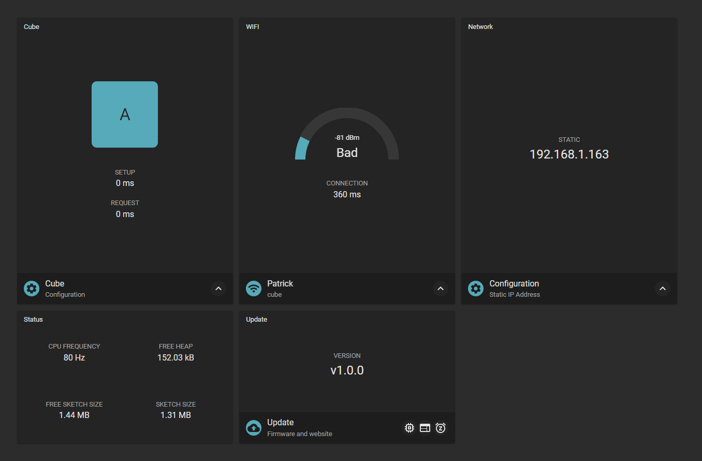
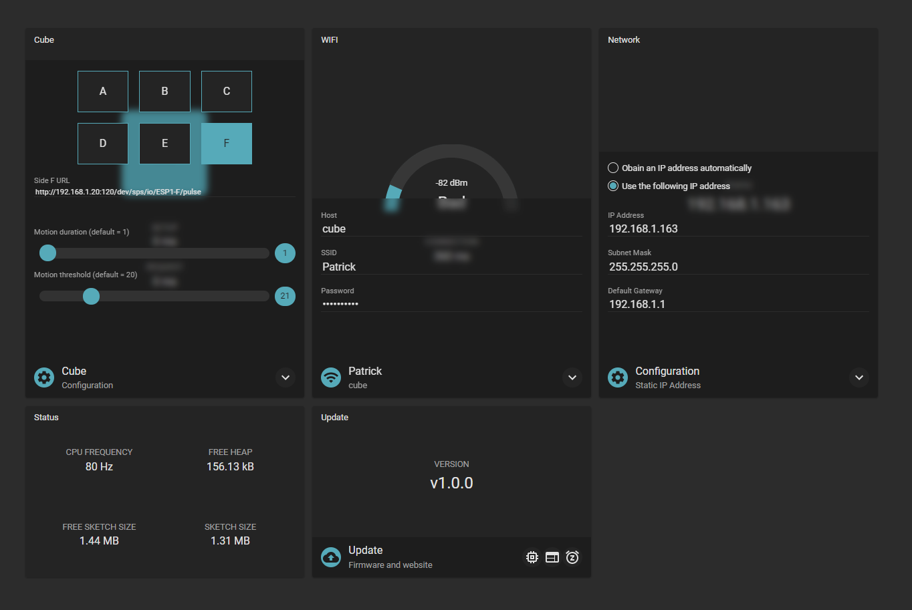

# espjs

ESP configuration template. 

## Screenshots 
Dashboard

Settings

## Available Scripts

Use yarn or npm to start the corresponding script. e.g. `yarn start`

| Command          | Description   |
| ---------------- | ------------- |
| start            | Runs the app in the development mode. The development server redirect all `/api` requests to `cube.local`. If your ESP is running on a different address, you can adjust the proxy server in the `webpack.config.js`  |
| test             | Launches the ESLint (lint) |
| lint             | ESLint - Code linter |
| build            | Builds the app for production to the `build` folder. |
| build:tsc        | Compile typescript code. |

